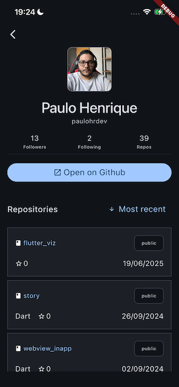
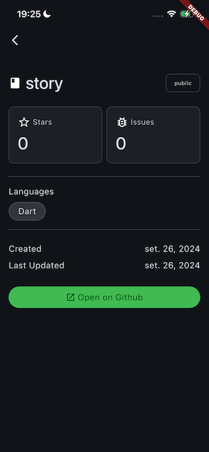

# GitHub User Explorer

Aplicativo mobile desenvolvido em Flutter que permite pesquisar usuários do GitHub, visualizar detalhes do perfil, listar repositórios públicos e manter um histórico local dos perfis visitados.

---

## Tecnologias utilizadas

| Pacote | Versão | Finalidade |
|---|---|---|
| Flutter | SDK ^3.11.5 | Framework mobile |
| `signals_flutter` | ^6.3.0 | Gerenciamento de estado reativo |
| `go_router` | ^17.2.3 | Roteamento declarativo |
| `dio` | ^5.9.2 | Cliente HTTP |
| `hive_ce` + `hive_ce_flutter` | ^2.19.3 / ^2.1.0 | Persistência local |
| `get_it` | ^9.2.1 | Injeção de dependência |
| `freezed` | ^3.2.5 | Modelos imutáveis com codegen |
| `flutter_dotenv` | ^5.2.1 | Variáveis de ambiente |
| `url_launcher` | ^6.3.2 | Abertura de links no navegador |
| `intl` | any | Formatação de datas |

---

## Arquitetura

O projeto segue **MVVM** conforme o guia oficial do time do Flutter, organizado em quatro camadas:

```
lib/
├── config/                         # Injeção de dependência (GetIt)
├── data/
│   ├── datasource/                 # Acesso direto à API e ao Hive
│   ├── repositories/               # Fonte de verdade única, coordena datasources
│   └── services/                   # Bootstrap do Hive (HiveService)
├── domain/
│   └── model/                      # Modelos com Freezed + @HiveType
├── routing/                        # go_router (rotas e constantes)
└── ui/
    ├── core/themes/                 # Tema e cores
    ├── search/                      # Busca de usuários
    ├── profile/                     # Perfil + lista de repositórios
    ├── repository/                  # Detalhes do repositório
    ├── history/                     # Histórico de perfis visitados
    ├── tabs/                        # Shell com bottom navigation
    └── splash/                      # Splash screen
```

**Fluxo de dados:**

```
UI (Watch) ← ViewModel (signals) ← Repository ← Datasource (Dio / Hive)
```

- **UI** — consome signals via `Watch`, sem lógica de negócio
- **ViewModel** — mantém estado como `signal()`, expõe métodos, sem imports do Flutter
- **Repository** — única fonte de verdade, retorna `Either<String, T>` para tratamento de erros
- **Datasource** — chamadas HTTP brutas (`UsersDatasourceImpl`) e operações na box do Hive (`HistoryDatasourceImpl`)

---

## Configuração do ambiente

### Pré-requisitos

- Flutter SDK `^3.11.5` ([instalação](https://docs.flutter.dev/get-started/install))
- Dart SDK `^3.11.5` (incluso no Flutter)
- Android Studio ou Xcode (para emulador/dispositivo)

### Variáveis de ambiente

Crie um arquivo `.env` na raiz do projeto com base no `.env.example`:

```bash
cp .env.example .env
```

Preencha a URL base da API pública do GitHub:

```
API_URL=https://api.github.com
```

> O arquivo `.env` é incluído como asset do Flutter e **não deve ser commitado**.

---

## Instalação

```bash
# Instalar dependências
flutter pub get

# Gerar código (adapters Hive + modelos Freezed)
dart run build_runner build --delete-conflicting-outputs
```

---

## Como rodar

```bash
# Dispositivo/emulador conectado
flutter run

# Android específico
flutter run -d android

# iOS específico
flutter run -d ios
```

---

## Como rodar os testes

```bash
flutter test
```

---

## Funcionalidades

- **Busca de usuários** — pesquisa com debounce de 700ms, infinite scroll com paginação, estados de loading e erro
- **Perfil do usuário** — avatar, nome, username, bio, seguidores, seguindo, repositórios públicos e link para o GitHub
- **Lista de repositórios** — nome, descrição, linguagem, stars e data de atualização, com ordenação por mais recentes ou mais antigos (nova requisição à API)
- **Detalhes do repositório** — nome, descrição, linguagem, stars, issues abertas, datas de criação e atualização, e link para abrir no navegador
- **Histórico** — persiste localmente com Hive os perfis visitados (avatar, username, data/hora), mantido entre sessões; toque reabre o perfil

---

## Screenshots

| Busca | Perfil | Repositório | Histórico |
|---|---|---|---|
|  |  |  |  |

---

## Decisões técnicas

**Por que MVVM e não Clean Architecture estrita?**
O desafio pede separação mínima de responsabilidades. MVVM com quatro camadas (UI, ViewModel, Repository, Datasource) atende isso sem a verbosidade de use cases e mappers DTO↔Entity.

**Por que `signals_flutter` e não Bloc?**
Reatividade fina com API minimalista — um `signal()` substitui `StreamController`, `BehaviorSubject` e `emit()`. O `Watch` widget reconstrói apenas o subárvore que depende do signal alterado.

**Por que Hive e não SQLite?**
O histórico é uma lista simples de objetos sem relações. Hive entrega isso com uma box tipada e zero overhead de schema SQL.

**Por que `dio` e não `http`?**
Interceptors, tipagem de resposta com genéricos e tratamento nativo de `DioException` com acesso ao body de erro da API (usado para exibir mensagens da GitHub API).
